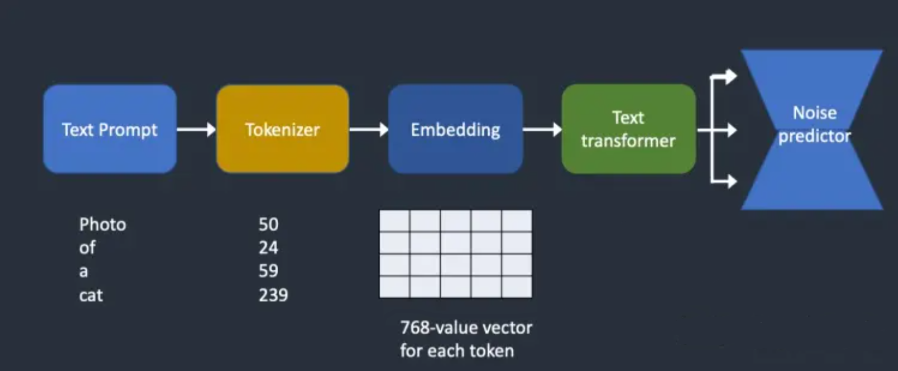
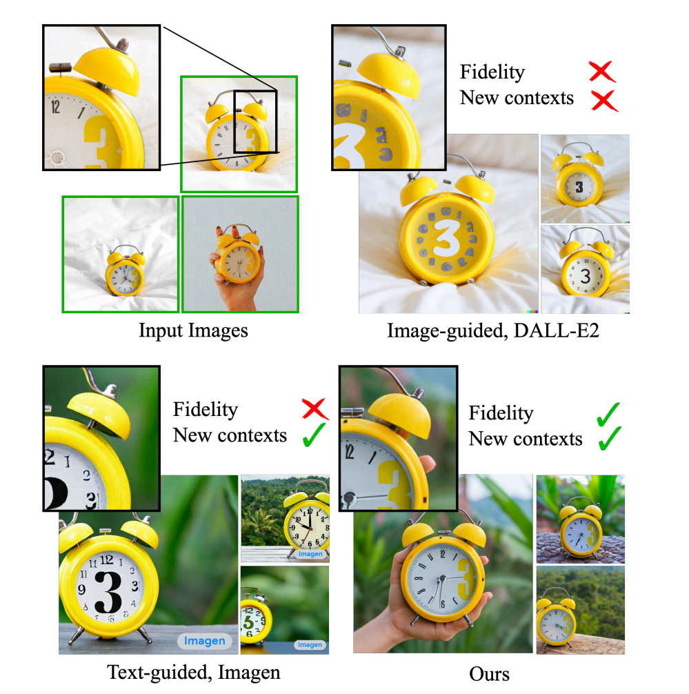
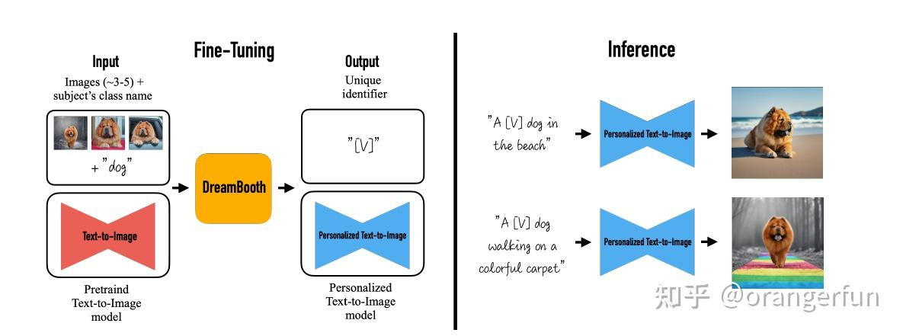
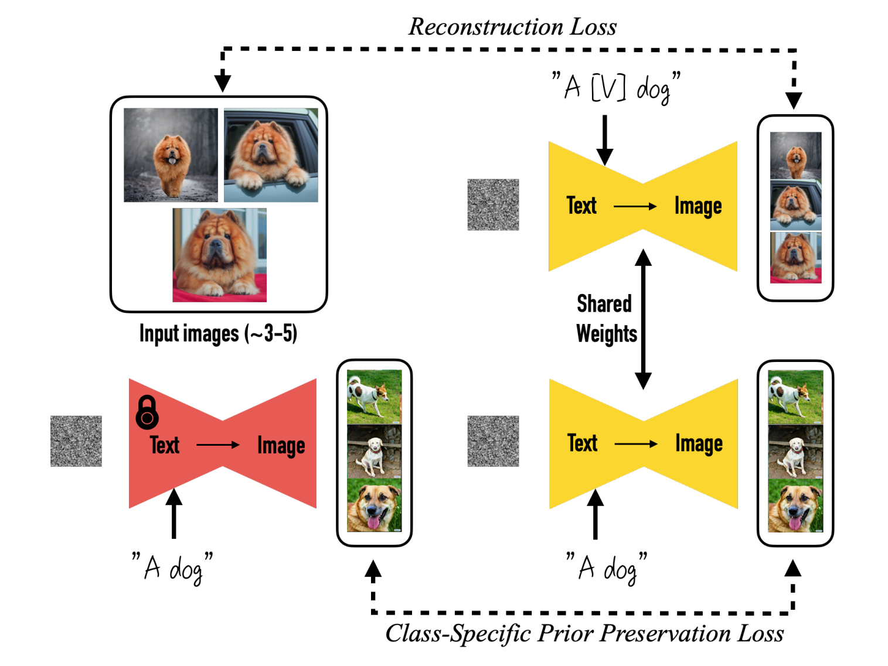
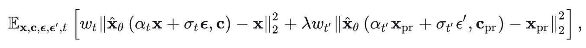
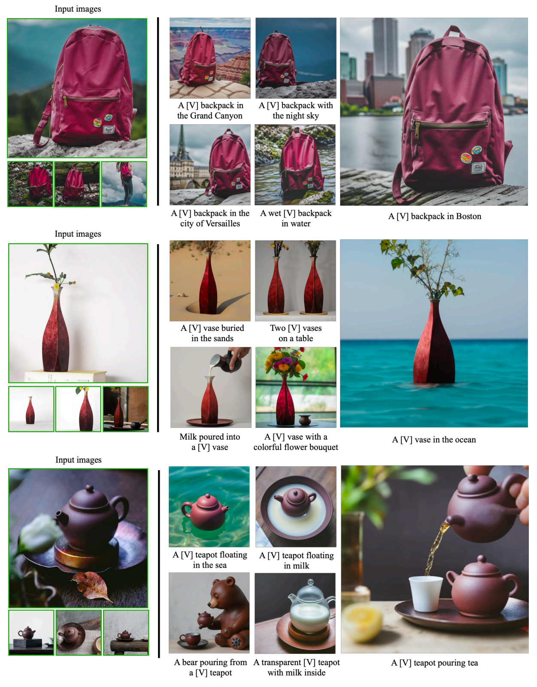

# Dreambooth使用教程

## 模型构建和选择
在模型创建界面有三个选项“名称”、“模型种类”、“源模型”。
- 名称：随你喜欢即可（建议全英）
- 模型种类：根据你想生成图片大小设置，
    - v1.x模型生成的是，512*512的图像大小
    - v2.x模型生成的是，768*768的图像大小
    - SDXL模型生成的是，1024*1024的图像大小
- 源模型：根据你想在哪个模型的基础上再进行训练而选择
- 界面右边出现 successfully即模型创建成功

## 模型概念配置
在概念栏里每个概念都有三个组成部分“Instance Images”、“Class Images”，“Sample Images”
- Instance Images——实例图片：
    - Directory：填写你数据集的文件夹的绝对路径
    - 提示词：
    - 词元实例：公式（***a [unique identifier] [Class noun]***），**unique identifier**是你的唯一标识符，**Class**是你的父类。           
    - 词元类别：这里就填**词元实例**里去掉**唯一标识符**的短句

- Class Images——类图片：
    - Directory：正则化的文件夹的绝对路径
    - 提示词：生成正则化的正向提示词（不要复杂，基本的描述即可）
    - 反向提示词：生成正则化的反向提示词（不要复杂，基本的描述即可）
    - 每个实例图像的类别图像数：2-5个即可
    - 分类提示词引导系数：就是和生图界面的提示词引导系数 (CFG Scale)意思是一样的
    - 提示词引导系数 (CFG Scale)：就是每张图去噪的次数

- Sample Images——样品图片：

    *到一定轮数会用训练出来的模型生成几张图*
    - 样本图像的正向提示词：字面意思
    - 样本图像的反向提示词：字面意思
    - 样本图像提示词模板文件：基本不用，想捣鼓就自己去玩吧，据说这个填上了前面两个选项就GG了
    - 要生成的样本数量：取决于你想看几张图
    - 样本种子：-1是随机，也可以固定随机种子
    - 样本无分类器引导系数(CFG Scale)：和正向提示词的相关性
    - 样本迭代步数：字面意思

## 参数设置
- Performance
    - 启动EMA：一般不勾选，用于梯度下降的 EMA 对于微调不重要，使用指数移动平均权重以避免在最终迭代中过度拟合。
    - 优化器：默认8bit AdamW即可
    - 混合精度：建议选择fb16效果更好
    - 内存注意力机制：选择xformers，如果没有这个选项，看看你的xformers版本是不是0.0.22以上的，
    - 缓存潜变量：勾选增加训练速度，但是会增加显存的使用。
    - 训练文本编码器 (TE/CLIP) 的步数比率：面部最佳为0.7。风格最佳为0.2；如果显存不足则设置为0，一般训练 Unet 的效果会更好
    - 噪声偏移 (Offset Noise)：数值越接近1越亮

- 间隔
    - 每张图的训练步数 (Steps):如果有3张图，这个选项数值设为5则总训练流程为15步，5个循环
    - 完成 N Epochs 后暂停 And 完成 N Epochs 后暂停：都为0，浪费时间的
    - 保存模型的频率 (Epochs)：就训练几轮保存一次模型
    - 保存预览图的频率 (Epochs)：几轮生成出一个样品图

- Batch Sizes
    - 单批数量 (Batch Size) And 确保训练的图像能够被上述两个值的乘积能够整除：确保训练的图像能够被上述两个值的乘积能够整除。例如上述两个值均被设置为2，那么整体的速度加快4倍，那么需要注意是图像能够被4整除。
    
- 学习率 (LR)
    - 学习率 (LR)：根据模型而异，建议是1e-6
    - 学习率调度器：默认的即可，他的特点是先变大再趋于平稳
    - 学习率预热步数：如果你的步数很大可以适当放大

- 存储

    自定义模型名称：他会创建一个文件夹，这里设置他的名字
    - 手动取消训练时生成一个 .ckpt 文件 和 训练过程中保存的同时生成一个 .ckpt 文件 这两个选项勾选即可，其他的不用管

- Lora
    - 别点使用Lora，除非你不想训练底模

- 先验损失函数 (Prior Loss)
    - 防止语言漂移的，如果有某个词被污染了的话就加高权重
    - 如果勾选了先验损失规模的话就可以更细致的调整他的权重范围了

# CLIP
### Dreambooth主要训练的就是CLIP，让我的特殊标记符有一个单独的向量表示，并让这个向量拟合数据集的特征

# 训练原理
### DreamBooth是一种个性化文生图模型：给定某个物体的几张图片作为输入，通过微调预训练的文生图模型（如Imagen），将一个独特的标识符和该物体进行绑定，这样就可以通过含有该标识符的prompt在不同场景下生成包含该物体的新颖图片。
 如下图所示，输入图片中包含一个闹钟，我们希望在不同场景下生成的图片里闹钟的样子尽可能与输入图片保持一致。

作者希望将输入图片中的物体与一个特殊标识符绑定在一起，即用这个特殊标记符来表示输入图片中的物体。因此作者为微调模型设计了一种prompt格式：a [identifier] [class noun]，即将所有输入图片的promt都设置成这种形式，其中identifier是一个与输入图片中物体相关联的特殊标记符，class noun是对物体的类别描述。这里之所以在prompt中加入类别，是因为作者想利用预训练模型中关于该类别物品的先验知识，并将先验知识与特殊标记符相关信息进行融合，这样就可以在不同场景下生成不同姿势的目标物体

作者提出的方法，大致如下图所示，即仅仅通过3到5张图片去微调文生图模型，使得模型能将输入图片中特定的物品和prompt中的特殊标记符关联起来

### 训练具体流程
1. 先用参数锁死的模型输入 a [class noun] 生成几张用来正则化的图片
2. 让一个参数开放的模型去学习数据集里的模型。
3. 分别用a [identifier] [class noun] 和 a [class noun] 生成出几张图
4. 使用 a [class noun] 生成出来的图和正则化的图进行损失计算（防止语言漂移）

### 语言漂移
这是一只瑞克老爷。拿这个作为训练，如果不带class image，你tag打了个 “1boy”，那么本身的 1boy 就会被 “污染”，也就是说，整个模型中，1boy 都会被染上瑞克老爷的一些特征，生成不了其他人了。这也是经典的过拟合现象

### 损失函数

论文提出的方法是想用少量图片（如3到5张）去微调文生图模型，微调过程中这些图片中都包含有相同的物体，且图片对应的prompt基本相同，都为 a [identifier] [class noun] 的形式，如果只用普通的微调方式，会出现两个问题：
1. 过拟合
2. 语言漂移：在大量文本语料上预训练的语言模型，在特定任务上微调时，它会逐渐忘记通用的语言知识，而仅仅适配特定的任务

考虑到上面两个问题，作者提出「使用预训练文生图模型自己生成的图片来监督微调过程」的方法，即用预训练的diffusion模型，输入随机初始化的噪声 Zt1 ~ N(0,I) 和条件 Cpr 来生成一部分图片数据 Xpr ,注意 Cpr对应的prompt形式为a [class noun]，也就是输入的类别。比如我们微调的prompt设置为一只可爱的金毛狗，那么此处生成数据输入的prompt为一只可爱的狗，把这些生成的狗的图片和之前准备金毛的图片合在一起训练，防止微调过程后模型只会生成金毛，而忘了其他狗。因此作者使用了如下损失函数。其中第二项是先验保存项，它用自己生成的图像监督模型，并控制该项的相对权重。

前半部分让模型学习特定物品的表示，后半通过生成图片的监督防止模型忘记先验知识，其中 $\widehat{X}$ 代表扩散模型，即输入图片 *X*，通过扩散模型加噪去噪后生成的图片尽量要和原始输入图片 *X* 尽量保持一致，后半部分对模型生成的训练数据也一样。

### 微调后模型生成图片结果

